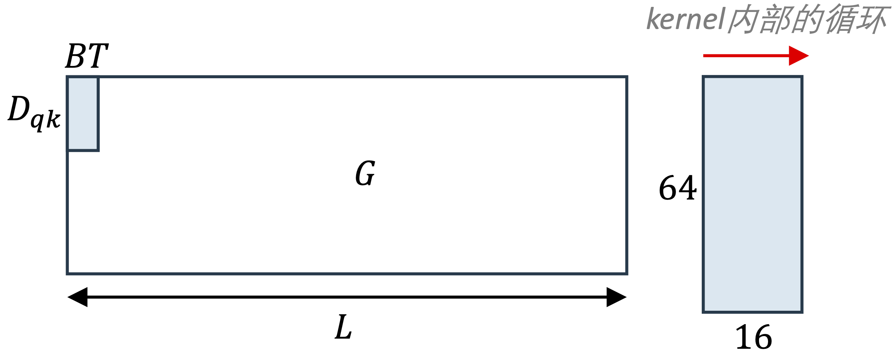
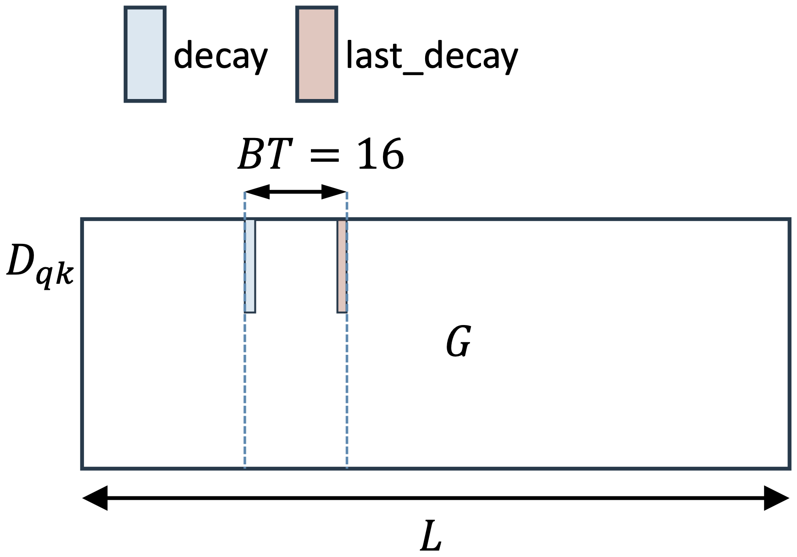

- [Run test](#run-test)
- [Gated Linear Attention Layer](#gated-linear-attention-layer)
- [Chunked Fuse 的实现](#chunked-fuse-的实现)
  - [1. fwd\_decay\_cumsum](#1-fwd_decay_cumsum)
  - [2. prepare\_qg\_kg](#2-prepare_qg_kg)
  - [3. fused\_chunk\_gla\_fwd\_kernel](#3-fused_chunk_gla_fwd_kernel)
  - [4. fwd\_inner\_chunk](#4-fwd_inner_chunk)
  - [5. combine inner and intra](#5-combine-inner-and-intra)

# Run test

```bash
python3 main.py
```

# Gated Linear Attention Layer

下面四行公式是gated linear attention layer在算法设计上得到的最终模型：

<p align="center">
<br>
Fig 1. GLA layer以recurrent模式单步计算的线性代数公式<br>
</p>

下图是GLA layer的实现转换为tensor operator之间的数据流依赖。**图中GLA圈出来的部分实现了论文中的公式（8）和（9），但分成了多个kernel。** 和RNN一样公式（8）带有时序依赖。

**从DNN模型设计的角度看GLA的数据流动，上图中蓝色虚线这一枝信息的流动起到了和传统RNN中input gate类似的功能，也是GLA这个模型中"gated"所指的部分。绿色虚线这一枝信息的流动起到了和传统RNN中output gate类似的功能。** 

>GLA中的gating factor是一个和输入$K$大小相同的tensor，***沿着时间维度对2D state的每个hidden维度以一个$[0,1)$进行不同强度的衰减***。

<p align="center">
<br>
Fig 2. GLA layer的数据流依赖
</p>

一些注释：

1. $\text{LogSigmoid}(x) = \log \frac{1}{1+\exp (-x)}$。将sigmoid函数的输出映射到log空间，将连乘转换为对数空间的连加。

    > 作者的代码实现看，PyTorch里LogSigmoid计算是以2位为底的对数，通过换底公式，将LogSigmoid激活的输出乘以 $\frac{1}{\ln 2}$（$\log_2\left(x\right) = \frac{\ln x}{\ln 2}$ ），转换为以 $e$ 为底的对数。然后通过$2^{x}$还原回sigmoid的输出，也就是gating的输出（gate是[0, 1)之间的一个浮点数）。

2. $\text{silu}(x) = x * \text{sigmoid}(x)$

<p align="center">
<br>
Fig 3. GLA layer以recurrent模式单步计算单时间步访问的数据<br>
</p>

我们把GLA看做是一个RNN layer（causal形式，不attend到未来时刻，$i$时刻只去attend $i$时刻之前）由以下计算得到：

>for $i \in \left[0, L - 1 \right)$
>
> $\quad h_i = h_{i-1} * \exp(g_{k_i}) + k_i \otimes v_i$  // 对状态进行衰减，与当前时刻状态相加
> 
> $\quad o_i = \text{sum}\left(q_i * \gamma * h_i, \text{dim}=-2\right)$  // 进行reduce压缩到1D

# Chunked Fuse 的实现

分成了5步，前4步是4个triton kernel，最后一步是一个简单的相加，用了PyTorch的operator。下面的符号都尽量沿用了代码中对应的变量名，以便和代码对应。

|Notation|Explanation|取值量级||
|:--:|:--|:--|:--|
|$B$|batch size|32|
|$L$|sequence length|2048|
|$H$|head number|4|
|$D_{qk}$|query和key的hidden dimension|1024或者2048这样的量级|
|$D_{v}$|value的hidden dimension|1024或者2048这样的量级|
|$BT$|序列长度维度上的分块大小|*固定取16*|太小了|
|$BK$|$D_{qk}$维度上的分块大小|$D_{qk}$和64中的较小值|
|$NK$|$NK=\frac{D_{qk}}{BK}$|$D_{qk}$维度上的分块数目|
|$BV$|$D_{v}$维度上的分块大小|$D_v$和64中的较小值|
|$NV$|$NV = \frac{D_v}{BV}$|$D_v$维度上的分块数目|

|输入tensor|形状|
|:--:|:--|
|$Q$|$[B, H, L, D_{qk}]$|
|$K$|$[B, H, L, D_{qk}]$|
|$V$|$[B, H, L, D_{v}]$|
|$gK$|$[B, H, L, D_{qk}]$|

下面表格第3列的”数据划分“，就对应了CUDA device kernel launch config中blocks的三个维度，也就是并发blocks数目。

|No.|Kernel|数据划分|theads per CTA|
|:--:|:--|:--|:--|
|1|$g_o=\text{fwd\_decay\_cumsum}(g)$|$NK,\frac{L}{BT}, B*H$|32|
|2|$q_g, k_g=\text{prepare\_qg\_kg}(q,k,g_o)$|$NK,\frac{L}{BT}, B*H$|32|
|3|$o = \text{fused\_chunk\_gla\_fwd\_kernel}(q_g,k_g,v,g_o,o)$|$NK, NV, B * H$|64|
|4|$o_2 = \text{fwd\_inner\_chunk}(q,k,g_o)$|$NK,\frac{L}{BT}, B * H$|128|
|5|combine inner and intra chunks|/|由PyTorch operator完成，见后面的说明|

## 1. fwd_decay_cumsum

第1个kernel是一个很小的element-wise kernel，用来计算沿着序列长度$L$维度的gated factor的累乘。输入的是通过低秩方法得到的gating factor $GK_{[B,H,L,D_{qk}]}$。由于多样本和多head之间完全独立，我们总是可以忽略$B$，$H$这两个全并行维度，他们最终会映射到CUDA的blocks之上并发进行处理。于是我们始终只关注如何处理一个序列。

Fig 4是fwd_decay_cumsum这个kernel处理数据的示意图，这个kernel在$G$的hidden维度和序列长度维度并行。

1. 每一个CTA相互独立地处理$D_{qk} \times BT$大小的数据。
2. 这个kernel的pattern是一个2D kernel，在序列长度维度上进行scan，在$G$的hidden dimension上没有数据依赖，可以全并发处理。

<p align="center">
<br>
Fig 4. fwd_decay_cumsum的并行方式
</p>

这个kernel内部带有一个pattern为scan的for循环 ：$Y=\text{scan}\left((\vec{s}, \vec{x})\rightarrow f, I=\vec{1}, \text{rows}(X)\right)$，$f(\vec{s},\vec{x})$是scan携带的二元算符，公式如下：

$$f(\vec{s},\vec{x}) = \vec{s} + \vec{x} / \ln 2 $$

这个kernel**可能是为了提高并行性**，在蓝色小块内部进行了累积和运算，但是小块之间是独立的，也就是说这个kernel计算完毕后，**gating factor在每一个长度为16的local窗口内进行了累积，但是并没有在全序列长度范围内进行累积**。

## 2. prepare_qg_kg

以$Q$，$K$，$V$和$G$为输入，以和$Q$，$K$等大的$Q_g$和$K_g$为输出，给$Q$和$K$都乘以gating factor $G$，进行衰减。这个kernel完成的数学计算如下（实现中需要先对$g$计算2的幂运算，将映射到对数空间的gating factor进行还原得到sigmoid的输出，下面的公式省略了这个2的幂运算)：

```python
load(last_decay)

for i in range(BT):
  load(_q)  # [BK]
  load(_k)  # [BK]
  load(_g)  # [BK]

  _q *= _g * scale
  _k *= (last_decay - _g)

  store(_k)
  store(_g)
```

$\qquad q_i = q_i * g_i * \gamma$
$\qquad k_i = k_i * (\text{last\_decay} - g_i)$

这个kernel和`fwd_decay_cumsum`的分数据方式，kernel内部循环方式完全一样，也就是每个kernel依然独立地去处理Fig 4中蓝色部分的数据块。当前kernel需要读取gating factor矩阵$G$中$D_{qk}$行，$BT$列大小的一块数据（Fig 4蓝色方块大小）的一块数据，来看`last_decay`的指针偏移计算，`last_decay`取到这块数据的最后一列。
```python
last_decay = tl.load(g + i_bh * s_qk_h + (i_c * BT + BT - 1) * DK + i_k * BK + tl.arange(0, BK))
```

取到的数据如下图所示：

<p align="center">

</p>

## 3. fused_chunk_gla_fwd_kernel

块间互相独立地进行计算，这个kernel的分数据方案如下，kernel 内部有**一个for**在序列长度维度进行循环。这和MHA的二重循环相比，已经极大的减少了计算的复杂度。作者在实现的时候，序列长度之上的分块固定为16，这个分块越大，重复计算的部分就会越多。

<p align="center">
<br>
Fig 5. fused_chunk_gla_fwd_kernel的并行方式
</p>

```python
b_h = zeros(BK, BV)  # hidden初始化为0
for i in range(L / BT):
    load(b_k)  # b_k 形状：[BK, BT]
    load(b_v)  # b_v 形状：[BT, BV]
    load(b_q)  # b_q 形状：[BT, BK]
    load(d_b)  # d_b 形状：[BK]

    b_o = zeros(BT, BV, dtype=float32)

    b_o = b_q @ b_h  # [BT, BV] = [BT, BK] @ [BK, BV]
    b_h = b_h * d_b + b_k @ b_v  # [BK, BV] = [BK, BV] * [BK, 1] + [BK, BT] @ [BT, BV]

    store(b_o)
```

这个kernel完成的数学计算：

$$
\begin{align*}
o &= q \otimes h_{t-1}\\
h_t &= h_{t-1} * g_{db} + k\otimes v
\end{align*}
$$

上面第2个公式中的$g_{db}$对应代码中以下部分的数据：

```cpp
p_db = g + i_bh * s_qk_h + (BT - 1) * s_qk_t + i_k * BK + tl.arange(0, BK)
```

$g_{db}$在初始时刻，取到了一个序列第一个分块（跨16列）的最后一列。随着kernel内的循环在序列长度分块上移动，$g_{db}$总是指向当前分块的最后一列。类似于`prepare_qg_kg`中`last_deacy`的作用。

## 4. fwd_inner_chunk

这个kernel分数据的方式和kernel 1，2 完全相同。每个小分块之间完全的独立。以$Q$，$K$和$G$为输入，输出tensor的大小$[NK,B,H,\frac{L}{BT},BT,BT]$。


<p align="center">
<br>
Fig 6. fwd_inner_chunk的并行方式
</p>

kernel内部的for循环在序列长度方向循环。Fig 6的右半部分是`fwd_inner_chunk` kernel内部access数据的示意图，下面的代码是这个kernel完成的计算（下面的变量名和上图以及作者代码中的实现完全相同，方便对应回作者的代码）：

```python
for i in range(BT):
  s = （_q * b_k） * (gq - b_g)  # 注意这里的形状，第一个“*”和最后一个“-”是broadcast
  score = sum(s, axis=1)  # reduce运算
  score = tl.where(o_i <= i, score, 0)  # o_i = range(0, BT)，causal mask
```

## 5. combine inner and intra

这一步是用PyTorch的tensor operator完成的。

```python
# A has a shape of [NK, B, H, L/BT, BT, BT]

v2 = rearrange(v, 'b h (n c) d -> b h n c d', n=num_chunk)
A = A.sum(0)  # A是`fwd_inner_chunk的输出`，[B, H, L/BT, BT, BT]
o2 = A @ v2  # [B, H, L/BT, BT, Dv]
o2 = rearrange(o2, 'b h n c d -> b h (n c) d')  # [B, H, L, Dv]
o.add_(o2)
```