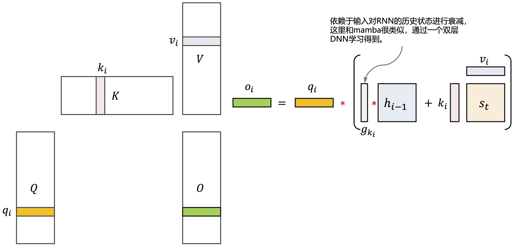
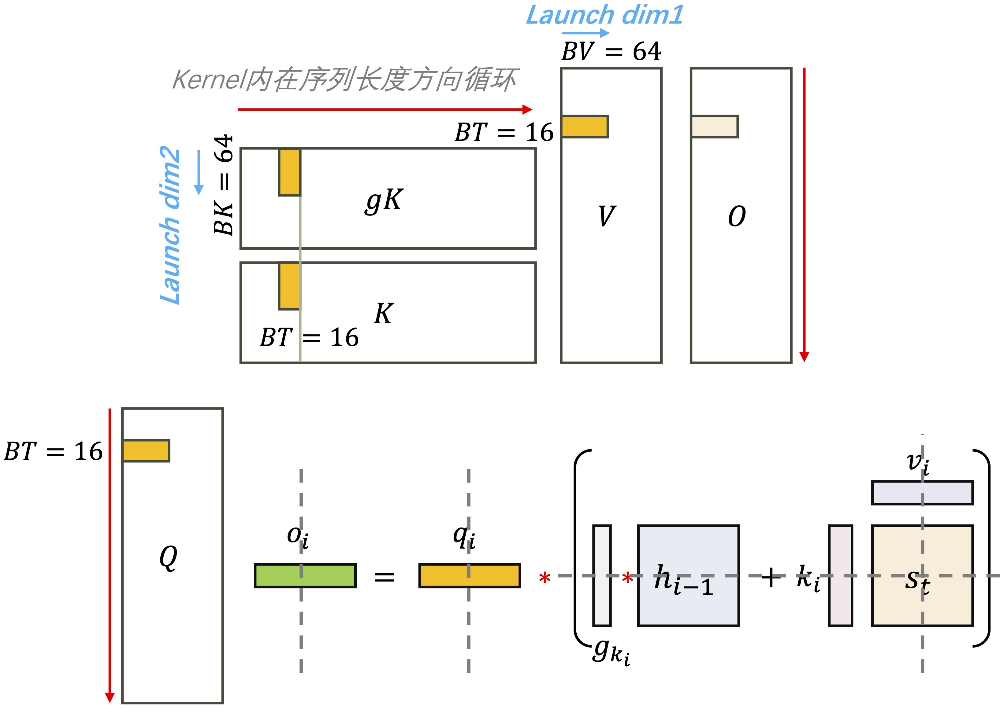
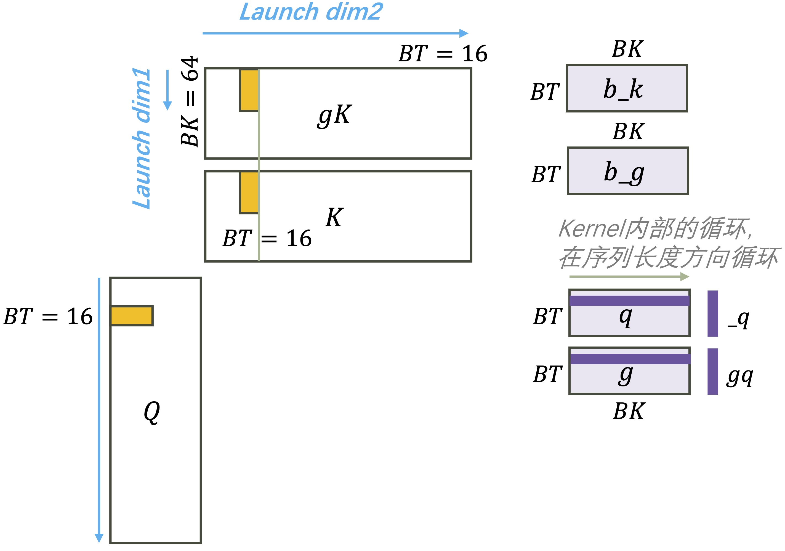

- [run test](#run-test)
- [Gated Linear Attention Layer](#gated-linear-attention-layer)
- [chunk\_fuse](#chunk_fuse)
  - [1. fwd\_decay\_cumsum](#1-fwd_decay_cumsum)
  - [2. prepare\_qg\_kg](#2-prepare_qg_kg)
  - [3. fused\_chunk\_gla\_fwd\_kernel](#3-fused_chunk_gla_fwd_kernel)
  - [4. fwd\_inner\_chunk](#4-fwd_inner_chunk)

# run test

```bash
python3 main.py
```

# Gated Linear Attention Layer

<p align="center">

</p>

1. $\text{LogSigmoid}(x) = \log \frac{1}{1+\exp (-x)}$。将sigmoid函数的输出映射到log空间，将连乘转换为对数空间的连加。

    > *从下面的计算过程看，PyTorch这里的对数是以2位为底的对数。 $通过换底公式，为这个输出乘以 $\frac{1}{\ln 2}$ 转换为以 $e$ 为底的对数 （\log_2\left(x\right) = \frac{\ln x}{\ln 2}$ ）*。

2. $\text{silu}(x) = x * \text{sigmoid}(x)$

**从DNN模型设计的角度看GLA的数据流动，上图中蓝色虚线这一枝信息的流动起到了和传统RNN中input gate类似的功能，也是GLA这个模型中"gated"所指的部分。绿色虚线这一枝信息的流动起到了和传统RNN中output gate类似的功能。**

GLA中的gating factor是一个和输入$K$大小相同的tensor，也就是对$K$的每个维度都进行不同强度的gating。

我们把GLA看做是一个RNN layer（causal形式，不attend到未来时刻，$i$时刻只去attend $i$时刻之前）由以下计算得到：

>for $i \in \left[0, L - 1 \right)$
>
> $\quad v_1 = q_i * \gamma * h_{t-1}*\exp(gk_i)$  // 对状态进行衰减
> 
> $\quad v_2 = k_i \otimes v_i$  // 当前时间步的输入
> 
> $\quad o_i = \text{sum}(v_1 + v_2, \text{dim}=-2)$  // 以上两步叠加

<p align="center">
<br>
Fig. GLA layer以recurrent模式单步计算的线性代数公式<br>
<br>
Fig. GLA layer以recurrent模式单步计算单时间步访问的数据<br>
</p>

# chunk_fuse

分成了5步，前4步是triton kernel，最后一步是一个简单的相加，用了PyTorch的operator。下面的符号都尽量沿用了代码中对应的变量名，以便和代码对应。

|Notation|Explanation|取值量级|
|:--:|:--|:--|
|$B$|batch size|32|
|$L$|sequence length|2048+|
|$H$|head number|4|
|$D_{qk}$|query和key的hidden dimension|1024或者2048这样的量级|
|$D_{v}$|value的hidden dimension|1024或者2048这样的量级|
|$BT$|序列长度维度上的分块大小|固定取16|
|$BK$|$D_{qk}$维度上的分块大小|$D_{qk}$和64中的较小值|
|$NK$|$NK=\frac{D_{qk}}{BK}$|$D_{qk}$维度上的分块数目|
|$BV$|$D_{v}$维度上的分块大小|$D_v$和64中的较小值|
|$NV$|$NV = \frac{D_v}{BV}$|$D_v$维度上的分块数目|

|输入tensor|形状|
|:--:|:--|
|$Q$|$[B, H, L, D_{qk}]$|
|$K$|$[B, H, L, D_{qk}]$|
|$V$|$[B, H, L, D_{v}]$|
|$gK$|$[B, H, L, D_{qk}]$|

下面表格第3列的”数据划分“，就对应了CUDA device kernel launch config中blocks的三个维度，也就是并发blocks数目。

|No.|Kernel|数据划分|theads per CTA|
|:--:|:--|:--|:--|
|1|$g_o=\text{fwd\_decay\_cumsum}(g)$|$NK,\frac{L}{BT}, B*H$|32|
|2|$q_g, k_g=\text{prepare\_qg\_kg}(q,k,g_o)$|$NK,\frac{L}{BT}, B*H$|32|
|3|$o = \text{fused\_chunk\_gla\_fwd\_kernel}(q_g,k_g,v,g_o,o)$|$NK, NV, B * H$|64|
|4|$o_2 = \text{fwd\_inner\_chunk}(q,k,g_o)$|$NK,\frac{L}{BT}, B * H$|128|
|5|$v_2 = \text{rearrange}(v, \text{'b h (n c) d'} \rightarrow \text{'b h n c d'}, n=\text{num\_chunk})$<br>$o = o+ o_2@v_2$|/|combine inner and intra chunks<br>由PyTorch operator完成|

## 1. fwd_decay_cumsum

第1个kernel是一个很小的element-wise kernel，用来计算沿着序列长度$L$维度的gated factor的累乘。输入的是通过低秩方法得到的gating factor $GK_{[B,H,L,D_{qk}]}$，总是可以忽略$B$，$H$这两个quanlu并行维度，只关注如何处理一个序列。下图是这个kernel处理数据的示意图，左图是blocks分原始问题，右图是一个thread block内部的计算方式。这个kernel在$GK$的hidden维度和序列长度维度并行。

<p align="center">
<br>
Fig. fwd_decay_cumsum的并行方式
</p>

这个kernel内部的计算是一个沿着蓝色箭头方向的scan，携带的二元算符是$+$，红色方向的全并行。

$Y=\text{scan}\left((\vec{s}, \vec{x})\rightarrow f, I=\vec{1}, \text{rows}(X)\right)$，$f(\vec{s},\vec{x})$是下面这个公式：

$$f(\vec{s},\vec{x}) = \vec{s} + \vec{x} / \ln 2 $$

## 2. prepare_qg_kg

这个kernel和上一个kernel的分数据方式，kernel内部分块加载方式完全一样。

这个last decay 偏移的位置没有懂？

```python
last_decay = tl.load(g + i_bh * s_qk_h + (i_c * BT + BT - 1) * DK + i_k * BK + tl.arange(0, BK))
```

$\_q = \_q * 2^{\_g} * \gamma$ $\qquad\leftarrow$ 这里2的幂次之后得到的是sigmoid的输出。
$\_k = \_k * 2^{\text{last\_decay} - \_g}$

为$Q$和$K$都乘以gating factor。

## 3. fused_chunk_gla_fwd_kernel

<p align="center">
<br>
Fig. fused_chunk_gla_fwd_kernel的并行方式
</p>

这个kerenl计算：

$$
\begin{align*}
o &= q \otimes h_{t-1}\\
h_t &= h_{t-1} *g + k\otimes v
\end{align*}
$$

## 4. fwd_inner_chunk

计算块内的下三角部分。

<p align="center">
<br>
Fig. fwd_inner_chunk的并行方式
</p>